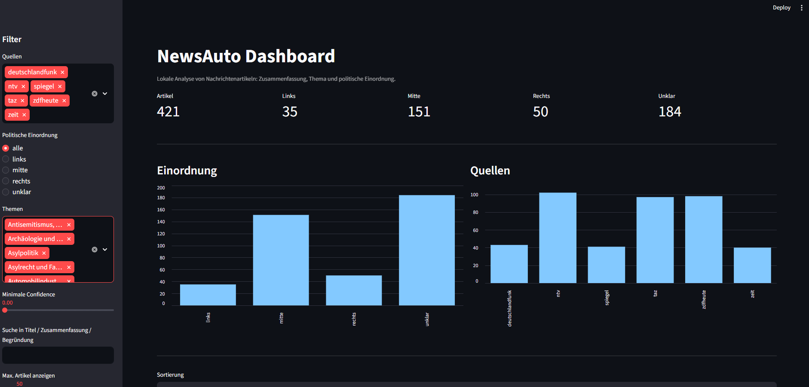

# NewsAuto



NewsAuto is a local-first news ingestion and analysis prototype.

It crawls German news sources via RSS, stores articles as JSONL, analyzes each article with a local LLM through Ollama, and displays the results in a Streamlit dashboard.

The project is intended as a portfolio and experimentation project for Python-based data pipelines, local LLM workflows, news analysis, and lightweight dashboards.

---

## Features

- RSS-based news crawling with Scrapy
- Multiple German news sources
- JSONL-based local data pipeline
- Local LLM analysis through Ollama
- Article summaries
- Topic extraction
- Article-level political classification:
  - `links`
  - `mitte`
  - `rechts`
  - `unklar`
- Confidence score for each classification
- Model reasoning for transparency
- Streamlit dashboard for local exploration
- Dashboard filters for:
  - source
  - topic
  - classification
  - confidence
- Fully local processing
- No external LLM API required

---

## Architecture

```text
RSS Feeds
   ↓
Scrapy Crawler
   ↓
data/news.jsonl
   ↓
Ollama / Local LLM
   ↓
data/analyzed_news.jsonl
   ↓
Streamlit Dashboard
```

---

## Requirements

- Python 3.11+
- Ollama
- A local Ollama model, for example:
  - `qwen3:4b`
  - `qwen2.5:7b`
  - `llama3.2:3b`

Python dependencies are listed in `requirements.txt`.

Recommended default model:

```text
qwen3:4b
```

---

## Installation

### 1. Clone the repository

```bash
git clone https://github.com/Sven-248/news-auto.git
cd news-auto
```

### 2. Create a virtual environment

Windows PowerShell:

```powershell
python -m venv .venv
.venv\Scripts\activate
```

Linux / macOS:

```bash
python -m venv .venv
source .venv/bin/activate
```

### 3. Install dependencies

```bash
pip install -r requirements.txt
```

---

## Configuration

The project uses environment variables for local configuration.

Copy the example file:

Windows PowerShell:

```powershell
copy .env.example .env
```

Linux / macOS:

```bash
cp .env.example .env
```

---

## Running Ollama

Install Ollama from:

https://ollama.com

Pull a model:

```bash
ollama pull qwen3:4b
```

Start Ollama:

```bash
ollama serve
```

Check if Ollama is running:

```bash
curl http://localhost:11434/api/tags
```

If Ollama is running correctly, this returns a JSON response with the available local models.

---

## Crawl News Articles

Run the Scrapy crawler:

```bash
scrapy crawl rss
```

This creates or updates:

```text
data/news.jsonl
```

You can also crawl a single source:

```bash
scrapy crawl rss -a source=tagesschau
```

Available sources are configured in:

```text
news_ingest/sources.py
```

---

## Analyze Articles with the Local LLM

Make sure Ollama is running before starting the analysis.

```bash
python news_ingest/analyze_news.py
```

This reads:

```text
data/news.jsonl
```

and writes:

```text
data/analyzed_news.jsonl
```

Each analyzed article contains a structure similar to:

```json
{
  "source": "example",
  "url": "https://example.com/article",
  "title": "Example title",
  "published_at": "2026-01-01T12:00:00+00:00",
  "analysis": {
    "summary": "...",
    "political_classification": "mitte",
    "confidence": 0.74,
    "reasoning": "...",
    "topic": "Innenpolitik"
  }
}
```

---

## Start the Dashboard

```bash
streamlit run app.py
```

Then open:

```text
http://localhost:8501
```

The dashboard allows you to:

- browse analyzed articles
- filter by source
- filter by topic
- filter by political classification
- filter by confidence
- read summaries
- inspect model reasoning
- open original articles

---

## Example Workflow

```bash
# 1. Start Ollama
ollama serve

# 2. Crawl news
scrapy crawl rss

# 3. Analyze articles
python news_ingest/analyze_news.py

# 4. Start dashboard
streamlit run app.py
```

---

## Recommended Models

For local analysis on consumer hardware, the following Ollama models are useful:

### Balanced default

```bash
ollama pull qwen3:4b
```

Good balance between quality, speed, and hardware requirements.

### Faster / lighter

```bash
ollama pull llama3.2:3b
```

Useful for faster batch processing.

### Higher quality, heavier

```bash
ollama pull qwen2.5:7b
```

Potentially stronger, but slower and more memory-intensive.

---

## Notes on GPU Usage

Ollama can use the GPU if a compatible GPU backend is available.

On NVIDIA systems, you can check GPU usage while the analysis is running:

```bash
nvidia-smi
```

If Ollama is using the GPU, you should see an `ollama` process and increased GPU utilization.

---

## Disclaimer

The political classification is experimental and generated by a language model.

It should be understood as an article-level analytical signal, not as an objective statement about a publisher, author, or media outlet.

The system does not claim to determine political truth. It attempts to classify framing, wording, topic emphasis, and article-level perspective based on the available text.

---

## Legal Notes

This project is intended as a local prototype for technical experimentation and portfolio purposes.

When crawling news websites, users are responsible for respecting:

- `robots.txt`
- website terms of service
- copyright law
- publisher rights
- applicable local regulations

Do not publish full article texts unless you have the necessary rights.

---

## Roadmap

Possible next steps:

- Add persistent storage with SQLite or Postgres
- Add event clustering across multiple news sources
- Compare reporting on the same topic across publishers
- Add source-level trend analysis
- Add technical news analysis profile for sources like Heise
- Add classification profiles:
  - political framing
  - tech applicability
  - security urgency
  - opinion vs factual reporting
- Add evaluation dataset for classification quality
- Add tests for JSON parsing and prompt output validation

---

## License

This project is currently intended as a personal portfolio and learning project.

Add a license before using or distributing it publicly.
