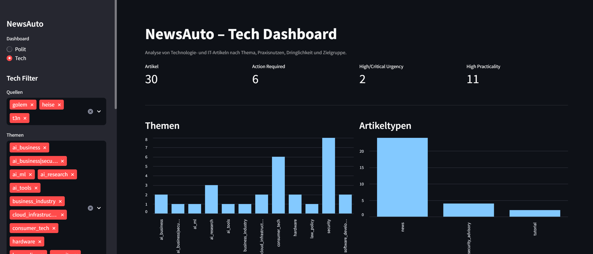

# NewsAuto



**Live Demo:** [Open NewsAuto Dashboard](https://news-auto.streamlit.app/)

NewsAuto is a local-first technology news ingestion and analysis prototype.

It crawls German technology and AI news sources via RSS, stores articles as JSONL, analyzes them with a local LLM through Ollama, and displays the results in a Streamlit dashboard.
The codebase also supports additional analysis profiles, but the public demo focuses on the Tech/AI profile.

The project is intended as a portfolio project for Python data pipelines, local LLM workflows, news analysis and lightweight dashboards.

---

## What it does

NewsAuto supports two analysis profiles:

| Profile | Purpose                                            |
| ------- | -------------------------------------------------- |
| `polit` | General German news and political framing analysis |
| `tech`  | Technology, IT, security and AI article analysis   |

### Political analysis

For general news articles, NewsAuto extracts:

- neutral summary
- topic
- political framing orientation
- political classification: `links`, `mitte`, `rechts`, `unklar`
- confidence score
- reasoning

### Tech analysis

For technology and AI articles, NewsAuto extracts:

- neutral summary
- article type
- primary topic
- practicality
- urgency
- target audience
- key technologies
- action required
- confidence score
- reasoning

---

## Architecture

```text
RSS Feeds
   ↓
Scrapy Crawler
   ↓
Profile-based JSONL files
   ↓
Ollama / Local LLM
   ↓
Analyzed JSONL files
   ↓
Streamlit Dashboard
```

The public demo uses static demo data and does not run live scraping or local LLM inference.

---

## Features

- RSS-based crawling with Scrapy
- Profile-based crawling with `polit` and `tech`
- Local LLM analysis through Ollama
- JSONL-based data pipeline
- Profile-aware Streamlit dashboard
- Political framing analysis for news articles
- Tech applicability analysis for technology and AI articles
- Fully local processing for live runs
- Public demo with static example data

---

## Installation

### 1. Clone the repository

```bash
git clone https://github.com/Sven-248/NewsAuto.git
cd NewsAuto
```

### 2. Create a virtual environment

Windows PowerShell:

```powershell
python -m venv .venv
.venv\Scripts\activate
```

Linux / macOS:

```bash
python -m venv .venv
source .venv/bin/activate
```

### 3. Install dependencies

```bash
pip install -r requirements.txt
```

---

## Configuration

Copy the example environment file:

Windows PowerShell:

```powershell
copy .env.example .env
```

Linux / macOS:

```bash
cp .env.example .env
```

---

## Running Ollama

Install Ollama from:

```text
https://ollama.com
```

Pull a model:

```bash
ollama pull qwen3:4b
```

Start Ollama:

```bash
ollama serve
```

Check if Ollama is running:

```bash
curl http://localhost:11434/api/tags
```

Recommended models:

| Model         | Use case                       |
| ------------- | ------------------------------ |
| `qwen3:4b`    | Balanced default               |
| `llama3.2:3b` | Faster and lighter             |
| `qwen2.5:7b`  | Higher quality, more demanding |

---

## Usage

### Crawl all political/news sources

```bash
scrapy crawl rss -a profile=polit
```

Output:

```text
data/news_polit.jsonl
```

### Crawl all tech and AI sources

```bash
scrapy crawl rss -a profile=tech
```

Output:

```text
data/news_tech.jsonl
```

### Crawl a single source

```bash
scrapy crawl rss -a source=heise
```

Example output:

```text
data/news_tech_heise.jsonl
```

---

## Analyze articles

Make sure Ollama is running first.

```bash
python news_ingest/analyze_news.py
```

Input and output files are configured in `.env`.

Example for political articles:

```env
NEWS_INPUT_PATH=data/news_polit.jsonl
NEWS_ANALYZED_OUTPUT_PATH=data/analyzed_polit.jsonl
POLIT_DASHBOARD_DATA_PATH=data/analyzed_polit.jsonl
```

Example for tech articles:

```env
NEWS_INPUT_PATH=data/news_tech.jsonl
NEWS_ANALYZED_OUTPUT_PATH=data/analyzed_tech.jsonl
TECH_DASHBOARD_DATA_PATH=data/analyzed_tech.jsonl
```

---

## Start the dashboard

```bash
streamlit run app.py
```

Then open:

```text
http://localhost:8501
```

The dashboard has separate views for:

- `Polit`
- `Tech`

The online demo uses:

```text
demo/analyzed_demo_tech.jsonl
```

---

## Source profiles

Sources are configured in:

```text
news_ingest/sources.py
```

Each source defines a profile:

```python
"heise": {
    "language": "de",
    "profile": "tech",
    "rss": [
        "https://www.heise.de/rss/heise-atom.xml",
    ],
}
```

Current example sources:

| Profile | Sources                                                         |
| ------- | --------------------------------------------------------------- |
| `polit` | Tagesschau, ZEIT, SPIEGEL, taz, Deutschlandfunk, ZDFheute, n-tv |
| `tech`  | Heise, Golem, t3n, The Decoder, All-AI                          |

---

## Data privacy

All live processing is local.

Generated data, model files and local environment files should not be committed.

Typical ignored files:

```text
.env
data/
*.jsonl
*.db
models/
*.gguf
```

The public demo contains only static example data.

---

## Disclaimer

The political classification is experimental and generated by a language model.

It should be understood as an article-level analytical signal, not as an objective statement about a publisher, author or media outlet.

The tech classification is also experimental. Fields such as urgency, practicality or action required should be interpreted as model-generated signals and not as professional security, legal or technical advice.

---

## Legal notes

This project is intended as a local prototype for technical experimentation and portfolio purposes.

When crawling news websites, users are responsible for respecting:

- `robots.txt`
- website terms of service
- copyright law
- publisher rights
- applicable local regulations

Do not publish full article texts unless you have the necessary rights.

---

## Roadmap

Possible next steps:

- Persistent deduplication across crawler runs
- SQLite or Postgres storage
- Event clustering across multiple sources
- AI-only dashboard filters
- Source-level comparison
- "Must know" scoring for important tech and security articles
- Optional scheduling for daily local runs

---

## License

This project is licensed under the [MIT License](LICENSE).
